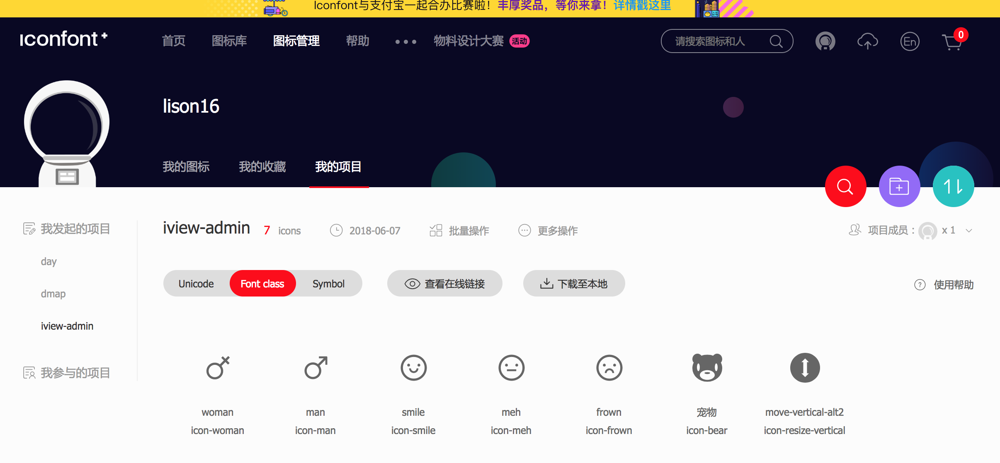

# Icons组件

在我们的项目中，可能需要的图标各式各样，iView内置的图标再多，可能都无法满足我们的需求，所以，使用Icons组件可以支持自定义图标。

#### step1

使用[Iconfont](http://www.iconfont.cn/)或者[IconMoon](https://icomoon.io/)制作字体文件。以Iconfont为例，阿里妈妈出品的图标下载和管理平台，提供免费丰富的图标，并且可以按项目管理，并打包下载。



选择`Font class`，并且点击`下载至本地`，即可下载字体文件压缩包。当然了，你也可以编辑每个图标的名字，方便你使用。下载后，文件夹内包含如下文件：
```shell
.
├── demo_fontclass.html
├── demo_symbol.html
├── demo_unicode.html
├── demo.css
├── iconfont.js
├── iconfont.css
├── iconfont.eot
├── iconfont.svg
├── iconfont.ttf
└── iconfont.woff
```
我们只需要最后这5个文件即可，看清楚哦，不需要js文件，然后把这5个文件放到iview-admin的`./src/assets/icons`文件夹下替换掉内置的即可。

#### step2

使用时，只需要填写在Iconfont中icon-后面的名字即可，比如这里的woman图标，在Iconfont中是icon-woman，使用时如下：
```javascript
<icons type="woman" />
```

#### API

- props

属性  |  说明  |  类型  |  默认值
:-------: | -------  |  :-------:  |  :-------:
type | 图标名称 | String | -
color | 图标颜色 | String | #5c6b77
size | 图标尺寸 | Number | 16
